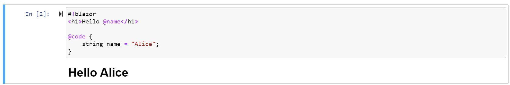

# .NET Interactive Notebooks Blazor Extension

[](https://www.nuget.org/packages/BlazorInteractive/)
[](https://github.com/plbonneville/BlazorInteractive/blob/main/LICENSE)

Compile and render Razor components (.razor) in .NET Interactive Notebooks.

## Table of content

- [Get started](#get-started)
- [Usage](#usageexamples)
- [How to compile this project](#how-to-compile-this-project)

## Get started

To get started with Blazor in .NET Interactive Notebooks, first install the `BlazorInteractive` NuGet package.

In a new `C# (.NET Interactive)` cell enter and run the following:

```
#r "nuget: BlazorInteractive, 1.0.19"
```

## Usage/Examples

Using the `#!blazor` magic command your code cell will be parsed by a Blazor engine and the results displayed using the `"txt/html"` mime type.

```razor
#!blazor
<h1>Hello @name</h1>

@code {
    string name = "Alice";
}
```



### Naming your components

You can name the generated Razor components using the `-n` or `--name` options.

```razor
#!blazor --name Counter
<h1>Counter</h1>

<p>
    Current count: @currentCount
</p>

<button class="btn btn-primary" @onclick="IncrementCount">Click me</button>

@code {
  public int currentCount = 0;

  void IncrementCount()
  {
    currentCount++;
  }
}
```

You can then use the component as any other class in the next code cells:

```csharp
var componentName = typeof(Counter).Name;
componentName
```

```csharp
var counter = new Counter();
counter.currentCount
```

## Sequence of commands and events

Here is an overview of the sequence of commands and events:


## Contributing

Contributions are always welcome!

### How to compile this project

Since this project requires a git submodule, you'll need to initialize and update the [Blazor REPL](https://github.com/BlazorRepl/BlazorRepl) submodule.

#### On the first `git clone`:

```
git clone --recurse-submodules -j8 https://github.com/plbonneville/BlazorInteractive.git
```

#### If you already have the repository cloned, run:

```
git submodule init
git submodule update
```

## Built with

- [Blazor REPL](https://github.com/BlazorRepl/BlazorRepl)
- [bUnit](https://github.com/bUnit-dev/bUnit)
- [.NET Interactive ](https://github.com/dotnet/interactive)
